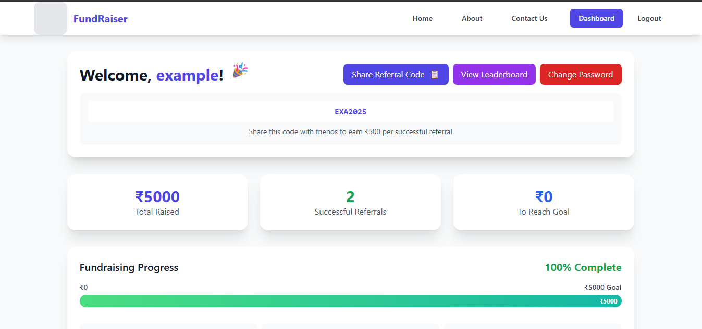
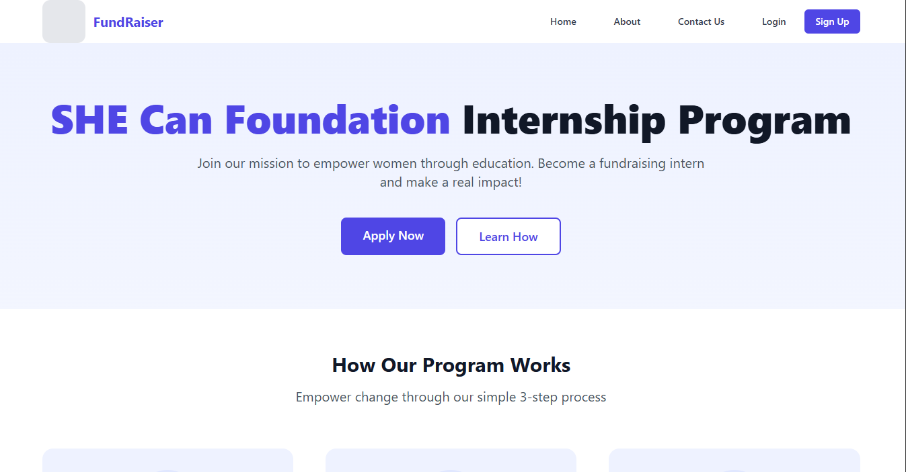
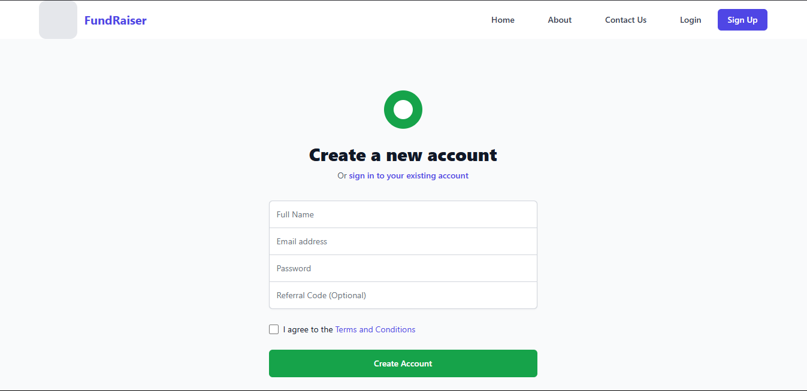
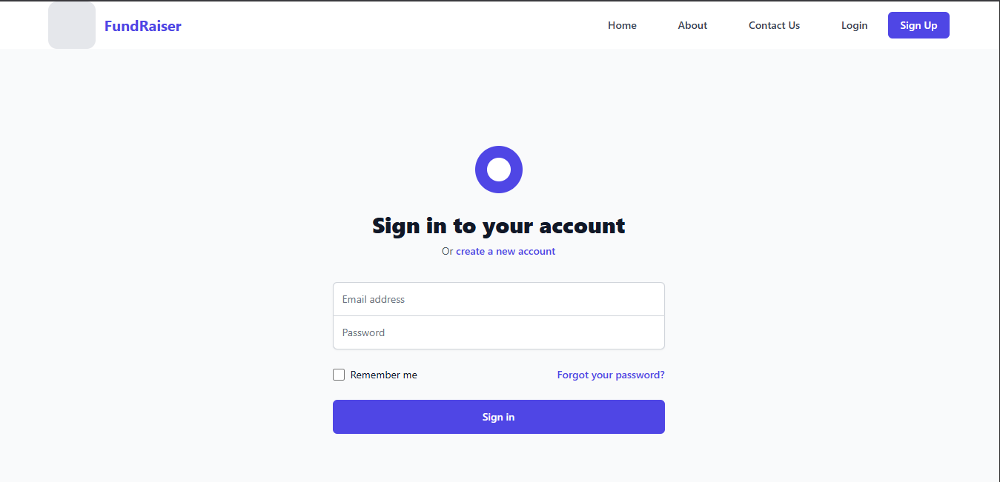
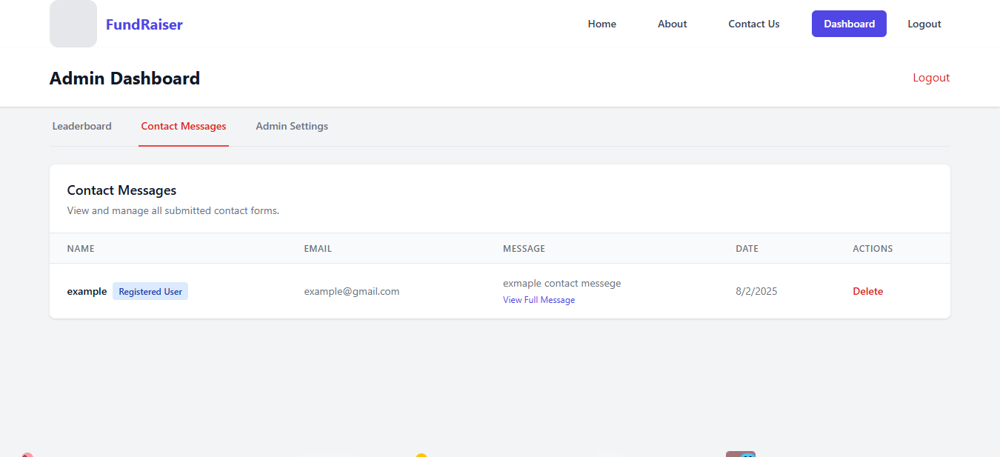
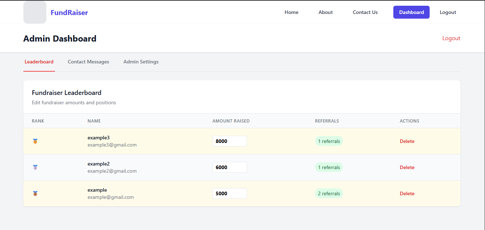
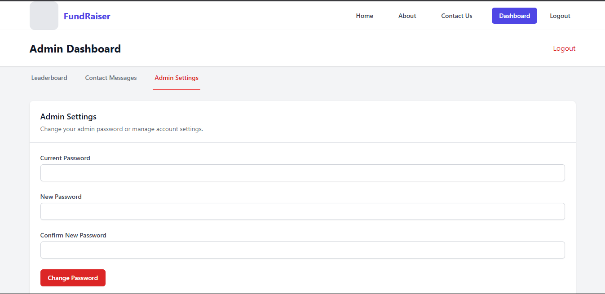
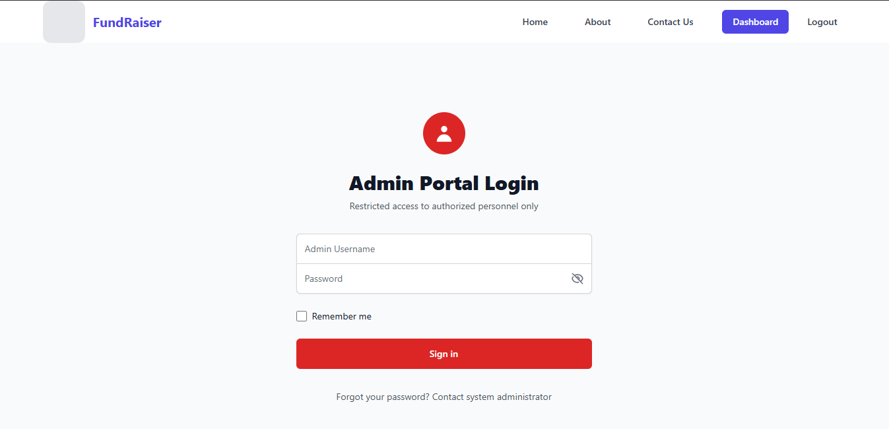

# 🚀 [Live Demo](https://she-can-intern-proj.onrender.com/) — She Can Intern Selection Portal (Full Stack Project)

## 📋 Project Title: **Fundraising Intern Selection Portal**

A **Full Stack Web Application** built as part of the **Full Stack Development Internship Assignment** using the **MERN Stack (MongoDB, Express.js, React.js, Node.js)** and **Tailwind CSS**.

This portal enables interns to register with referral codes, track their referral-based earnings, and allows admins to manage users, funding, and contact messages through a secured dashboard.

---

## ✨ Features

- 🌐 **Fully Responsive & Animated UI (Tailwind CSS + AOS Animations)**
- 📝 **Referral-based Registration & Authentication System**
- 🏠 **User Dashboard** displaying Referral Code, Earnings, Leaderboard Rank, and Rewards.
- 📨 **Contact Us Page** with auto-filled credentials for logged-in users.
- 📊 **Leaderboard** showcasing top fundraisers & user's current position.
- 🔑 **Change Password**, **Forgot Password & Reset Password** flows.
- 🖥️ **Admin Dashboard** with full CRUD controls over users, funding, and messages.
- 🔄 **Live CRUD Operations** connected to MongoDB Atlas.
- 🛡️ **Environment-based Admin Credential Seeding** via Script.
- 🚀 **Deployed on Render (Backend & Frontend).**

---

## 🏗️ Tech Stack Overview

| Frontend                       | Backend             | Database      | Deployment                 |
| ------------------------------ | ------------------- | ------------- | -------------------------- |
| React.js, Tailwind CSS, AOS.js | Node.js, Express.js | MongoDB Atlas | Render (Full Stack Deploy) |
| React Toastify (Notifications) | Mongoose ORM        |               |                            |

---

## 📂 Folder Structure

```

/She\_Can\_Intern\_SelectionProj
├── /backend
│   ├── /models/               // Mongoose Schemas (Intern, Admin, Contact)
│   ├── /routes/               // Express API Routes
│   ├── /controllers/          // Route Handlers/Controllers
│   ├── /utils/                // Helper Functions
│   ├── server.js              // Main server entry point
│   └── seedAdmin.js           // Admin Seeder Script
├── /frontend
│   ├── /src/components/       // React Components (Dashboard, Leaderboard, etc.)
│   ├── /src/pages/            // Page Components (Home, About, Contact, Admin)
│   ├── App.js, index.js       // React Entry Points
│   ├── tailwind.config.js     // Tailwind Configuration
├── /screenshots                // Screenshots for README
├── README.md
└── package.json               // Project Dependencies

```

---

## 🖼️ Screenshots & Previews

| **Dashboard View**                        | **Leaderboard View**                                   |
| ----------------------------------------- | ------------------------------------------------------ |
|  |  |

| **Home Page**                   | **Register Page**                       |
| ------------------------------- | --------------------------------------- |
|  |  |

| **Login Page**                    | **Contact Messages (Admin View)**                 |
| --------------------------------- | ------------------------------------------------- |
|  |  |

| **Admin Leaderboard View**                               | **Admin Password Update View**                     |
| -------------------------------------------------------- | -------------------------------------------------- |
|  |  |

| **Admin Login Page**                         |
| -------------------------------------------- |
|  |

---

## 🔑 Environment Variables Setup

### Backend (`/backend/.env`)

```env
MONGO_URI=your_mongodb_connection_string
PORT=5000
ADMIN_USERNAME=your_admin_username
ADMIN_PASSWORD=your_admin_password
FRONTEND_URL=http://localhost:3000
```

### Frontend (`/frontend/.env`)

```env
REACT_APP_BACKEND_URL=http://localhost:5000
```

---

## 🛡️ Admin Credentials Setup Guide

1. Define **`ADMIN_USERNAME`** and **`ADMIN_PASSWORD`** in `/backend/.env` and also **`MONGO_URI`\*\***`PORT`\***\*`FRONTEND_URL`**
2. Define **`ADMIN_USERNAME`** and **`REACT_APP_BACKEND_URL`** in `/frontend/.env`.
3. Run the **Admin Seeder Script**:

   ```bash
   cd backend
   node seedAdmin.js
   ```

   - Creates admin if not exists.
   - Updates password if admin exists but password differs.

4. Access **Admin Panel** at:

   ```
   /admin/login
   ```

   (Credentials are secured via `.env`)

---

## ⚙️ How to Run Locally

```bash
# Clone the repository
git clone https://github.com/mdwarish7867/She_Can_Intern_SelectionProj.git
cd She_Can_Intern_SelectionProj

# Backend Setup
cd backend
npm install
# Add .env file and run:
node seedAdmin.js
npm start

# Frontend Setup
cd ../frontend
npm install
# Add .env file
npm start
```

---

## 🚀 Deployment Links

| Service            | Live URL                                                                                                                             |
| ------------------ | ------------------------------------------------------------------------------------------------------------------------------------ |
| Frontend & Backend | [https://she-can-intern-proj.onrender.com/](https://she-can-intern-proj.onrender.com/)                                               |
| GitHub Repository  | [https://github.com/mdwarish7867/She_Can_Intern_SelectionProj.git](https://github.com/mdwarish7867/She_Can_Intern_SelectionProj.git) |

---

## 🎯 Key Functional Modules

### ✅ User Module:

- Registration with referral code.(Try This SW9D8B)
- Dashboard displaying referral code, earnings, leaderboard rank.
- Change Password & Forgot/Reset Password.
- Contact Us Form with dynamic fields.
- If Sometimes Deployed Not Work Then Try Locally Please

### ✅ Admin Module:

- Admin Login (Environment-based Credentials).
- User Management (View, Delete, Update Funding).
- Contact Message Management.
- Password Change functionality.

### ✅ Referral & Funding Logic:

- Every new referral increments the referrer's total funding by ₹500.
- Leaderboard dynamically ranks based on total raised funds.

---

## 📝 To-Do (Enhancements Roadmap)

- SMTP Email Integration for Forgot/Reset Password.
- Pagination & Filtering in Admin Panels.
- Enhanced UI for mobile devices.
- Advanced analytics on dashboard.

---

## 📧 Contact

| Name                 | LinkedIn                                                                    | Email                                                         |
| -------------------- | --------------------------------------------------------------------------- | ------------------------------------------------------------- |
| **MD Warish Ansari** | [LinkedIn Profile](https://www.linkedin.com/in/md-warish-ansari-46b1ab258/) | [warishansari018@gmail.com](mailto:warishansari018@gmail.com) |

---
